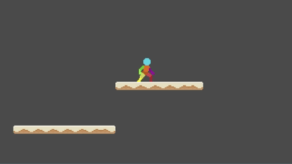

# Godot-platformer

Platformer starter for Godot - testing out the engine

More details soon, aiming for feature parity with my [Game Maker Platformer](https://github.com/deanblackborough/gm-platformer) 
project soon and then more in this as it appears to be the favourite over the Game Maker Studio

## Current Progress

## Current Features (WIP)

This starter is built around a simple but extensible state machine. The goal is to keep the player logic clean, physics consistent, and states lightweight so they can be expanded later.

### Player States

#### Currently implemented:

- Fall
- Idle (with or without weapon)
- Jump
- Run (with or without weapon)
- Land
- Hard Land
- Idle Crouched
- Walk Crouched
- Attack Jab
- Attack Overhead

#### Core Systems

- Lightweight state scripts: Most logic lives in the Player script; states just handle 
switching and physics adjustments.
- Signals for player status: Track options like crouching or weapon draw state.
- Weapon handling: Weapons are automatically sheathed in states where attacking isn’t possible.
- Committed attacks: Once an attack starts, it must finish—no cancelling or mid-swing switching.

#### Combat & Collision

- Basic hurtboxes + hitboxes: Enemies are deleted on hit for now—health/damage systems are still in progress.
- Multiple collision states: Uses RayCast2D to check whether the player can stand (prevents clipping into ceilings).
- Jump system: Includes configurable max jumps, coyote time, and input buffering.
- Landing weight: Both hard land and soft land timers add a sense of impact.
- Force stand mechanic: Player is forced upright after crouch-jumps and crouch-falls.

#### Level & Debugging

- Grass terrain tileset with sides-based terrain setup.
- Detail tileset for background/world dressing.
- Debug panel to display current state and runtime values.

## Next
- Added basic enemy anims (1 frame) - working on states for idle, attack, die, patrol and target
- Collision for overhead attack
- Enemy and player health
- General combat feel
- Attach when weapon sheaved should draw weapon ready for attack
- much more.

# Issues
- Landing weird when on corner
- We don't need state in state names

## To do
Everything to get it equal to the [Game Maker Platformer](https://github.com/deanblackborough/gm-platformer) project and much more

## Credits

- Player character is by https://zegley.itch.io/ - check his page for this asset [here](https://zegley.itch.io/2d-platformermetroidvania-asset-pack)
- Level assets by Kenney http://support.kenney.nl - modified slightly
